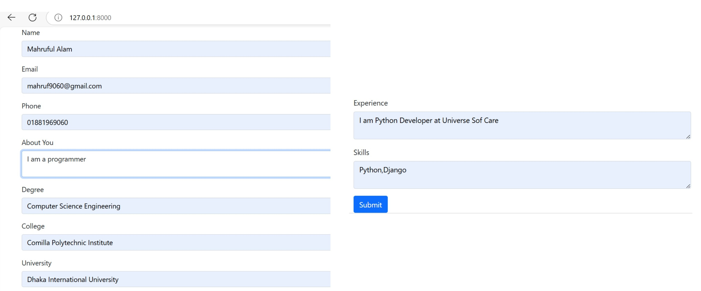
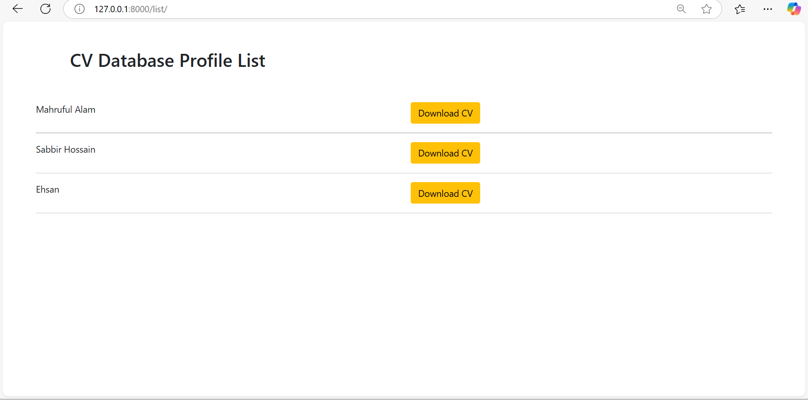
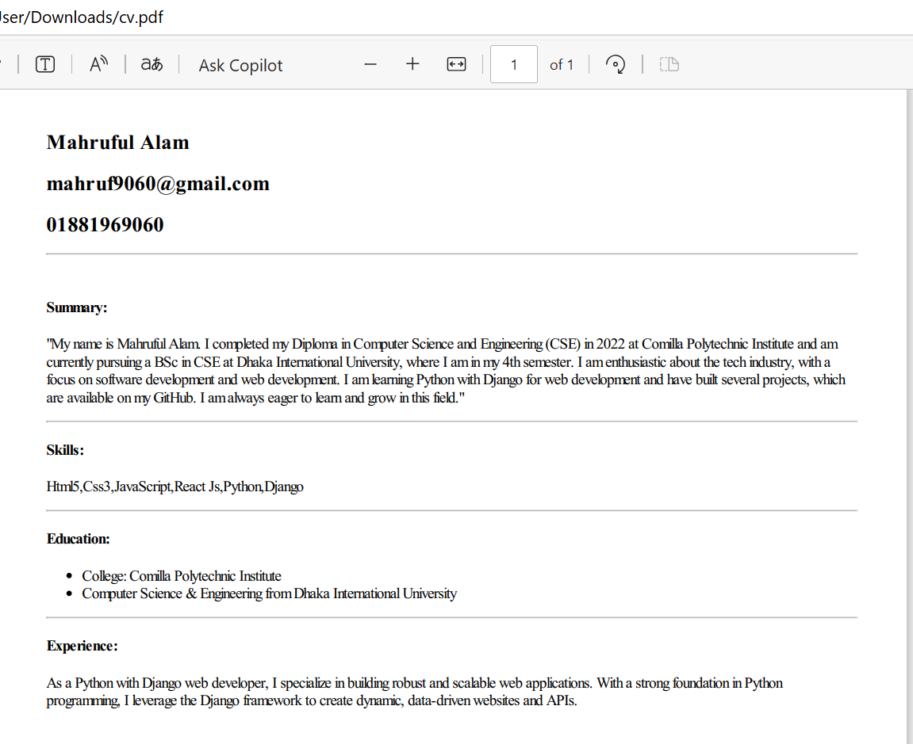
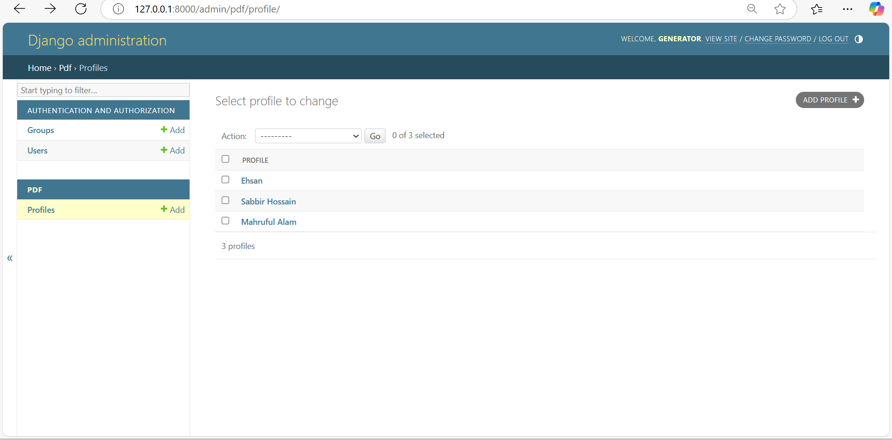

# CV Generator Application

A Django-based web application that allows users to manage and download CVs for various profiles. The project includes an admin interface for adding and managing profiles and a front-end for downloading CVs as PDFs.

## Features

- **Profile Management**: Add and manage profiles via the Django admin interface.
- **CV Download**: Users can download profiles' CVs in PDF format.
- **Responsive Design**: Simple and clean front-end interface.
- **PDF Generation**: Dynamically generate CVs using stored profile information.

## Screenshots

### Profile List


### Profile List


### Sample CV


### Admin Interface


## Installation

1. Clone the repository:

   ```bash
   git clone https://github.com/CoderMahruf/CV_Generator-Web_based.git
   cd mysite
   ```

2. Create and activate a virtual environment:

   ```bash
   python -m venv env
   source env/Scripts/activate 
   ```

3. Install dependencies:

   ```bash
   pip install -r requirements.txt
   ```

4. Apply database migrations:

   ```bash
   python manage.py migrate
   ```

5. Create a superuser to access the admin panel:

   ```bash
   python manage.py createsuperuser
   ```

6. Run the development server:

   ```bash
   python manage.py runserver
   ```

7. Access the application:
   - Frontend: [http://127.0.0.1:8000](http://127.0.0.1:8000/list/)
   - Frontend: [http://127.0.0.1:8000/list/](http://127.0.0.1:8000/list/)
   - Admin Panel: [http://127.0.0.1:8000/admin/](http://127.0.0.1:8000/admin/)

## Usage

### Adding Profiles
1. Log in to the Django admin panel.
2. Navigate to the "Profiles" section.
3. Add new profiles with details like name and uploaded CVs.

### Viewing and Downloading CVs
1. Open the front-end application.
2. Click on "Download CV" to download a specific profile's CV as a PDF.

## Technologies Used

- **Backend**: Django
- **Frontend**: HTML, CSS, Bootstrap
- **PDF Generation**: Django libraries (e.g., pdfkit,  wkhtmltox)


## Contributing

1. Fork the repository.
2. Create a new branch for your feature/bug fix.
3. Submit a pull request for review.

## License

This project is licensed under the MIT License.

